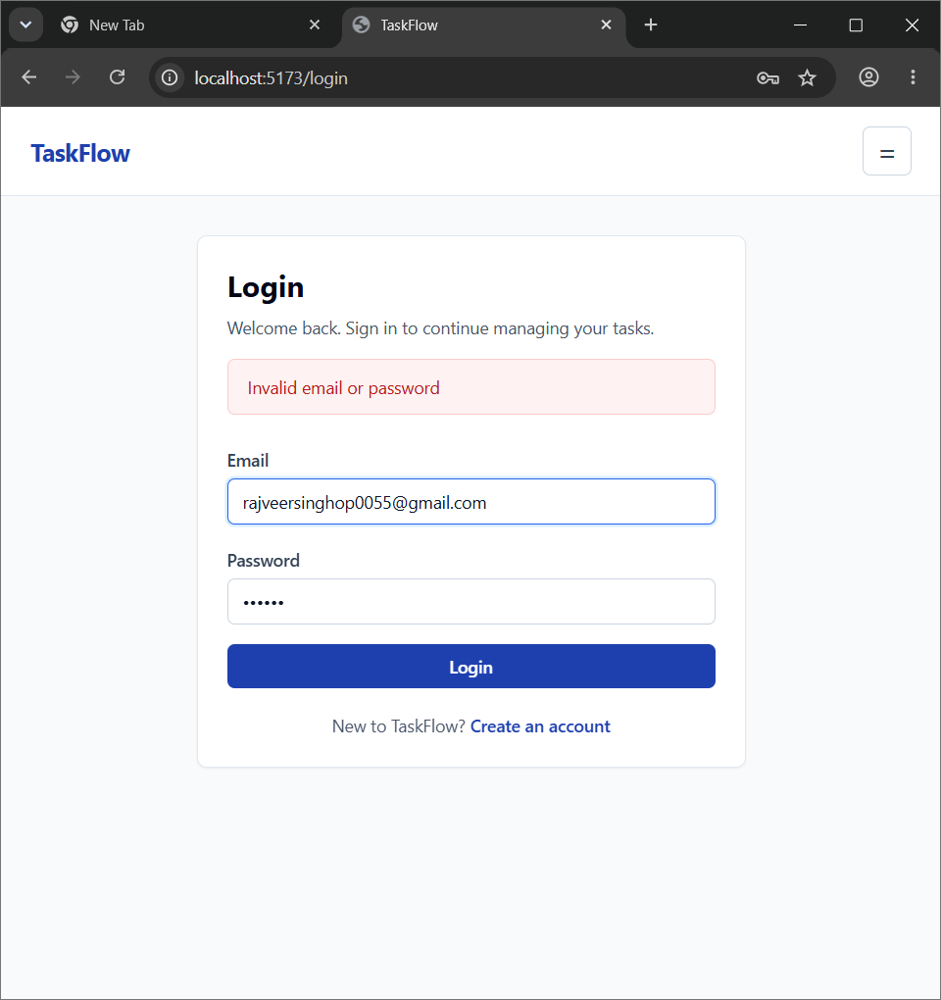
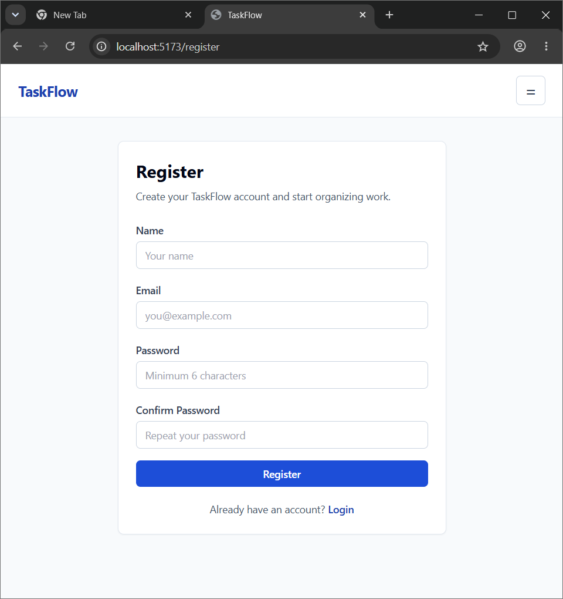
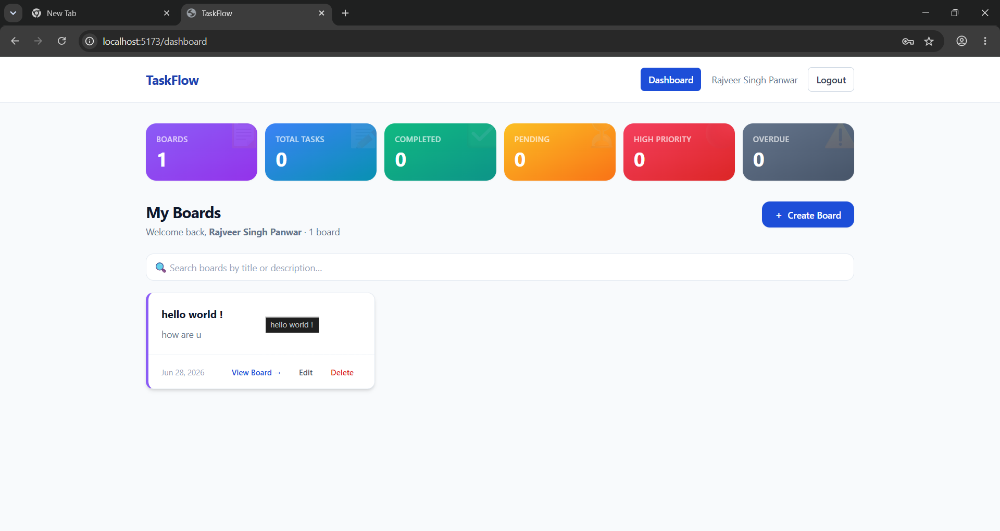
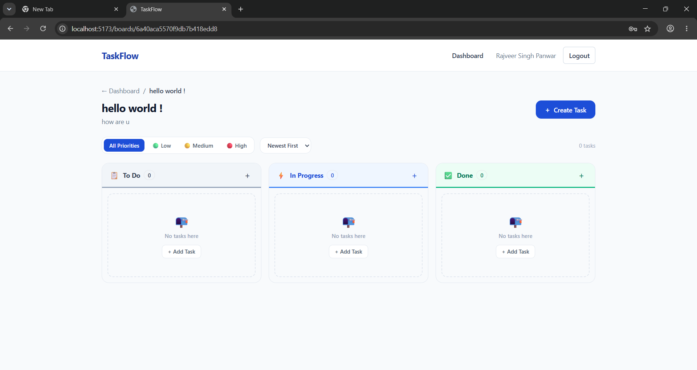

# TaskFlow

## Project Overview
TaskFlow is a production-ready, beautiful, and secure Kanban-based Task Management application built using the MERN stack (MongoDB, Express, React, Node.js). Designed for teams and individuals to organize their daily projects, it features dynamic Kanban boards, secure multi-user authorization, real-time statistics, global search, and OpenRouter-powered Gemini AI task estimation.

---

## Features

- **Authentication**: JWT-based secure authorization with password hashing (bcryptjs) and automatic bearer token injection for requests.
- **Board Management**: Complete Board CRUD (Create, Read, Update, Delete) with interactive customizable board cards and automatic task cascade cleanup.
- **Task Management**: Structured Task creation, detailed tracking, priority scheduling, and overdue validation.
- **Kanban Board**: Dynamic 3-column workflow (To Do, In Progress, Done) with quick-status click cycles (Todo → In Progress → Done).
- **AI Suggest Estimate (OpenRouter)**: Supercharged estimations for effort and due dates using Gemini models via OpenRouter, supported by a bulletproof fallback service.
- **Search & Filters**: Instant debounced search for boards and columns, and priority filtering with multi-criteria task sorting.
- **Responsive UI**: Hand-crafted mobile-first design scaling elegantly across mobile, tablet, and desktop viewports.

---

## Tech Stack

### Frontend
- **Core**: React 19 (Vite)
- **Styling**: Tailwind CSS
- **Routing**: React Router DOM (v7)
- **HTTP Client**: Axios (configured with request context headers)
- **Feedback**: react-hot-toast, skeleton loaders, and dynamic transitions

### Backend
- **Platform**: Node.js & Express
- **Security Headers**: Helmet
- **API Protection**: express-rate-limit
- **CORS**: Dynamic origin options configuration

### Database
- **Database**: MongoDB Atlas
- **ORM**: Mongoose

### AI Provider
- **API Gateway**: OpenRouter API (Gemini models)

### Deployment
- **Frontend**: Vercel
- **Backend**: Render
- **Database Cloud**: MongoDB Atlas

---

## Folder Structure

```text
taskflow/
├── client/                     # Frontend Vite React App
│   ├── src/
│   │   ├── assets/             # Global media and icon assets
│   │   ├── components/         # Reusable UI modules (Kanban boards, modal dialogs)
│   │   ├── context/            # AuthContext (global user state, login/logout session)
│   │   ├── pages/              # Lazy-loaded page components (Dashboard, BoardDetails)
│   │   ├── routes/             # Route configurations with dynamic Suspense boundaries
│   │   ├── services/           # Service layer for Axios client requests
│   │   ├── App.jsx             # App layout structure
│   │   ├── index.css           # Global custom styled Tailwind rules
│   │   └── main.jsx            # Main React mount point
│   ├── vite.config.js          # Compile configs & development proxy
│   └── package.json
│
└── server/                     # Backend Express API Server
    ├── config/                 # DB connection and auto-retry policy
    ├── controllers/            # Controller logic (CRUD methods & ownership verification)
    ├── middleware/             # Auth middleware guards & MongoDB validators
    ├── models/                 # Database models (User, Board, Task)
    ├── routes/                 # Endpoint routing entry points
    ├── services/               # OpenRouter REST proxy service
    ├── server.js               # Express application setup, security, and rate-limits
    └── package.json
```

---

## Installation

### Backend Setup
1. Navigate to the server folder:
   ```bash
   cd server
   ```
2. Install npm dependencies:
   ```bash
   npm install
   ```
3. Copy `.env.example` to `.env` and configure your settings:
   ```bash
   cp .env.example .env
   ```
4. Start the development server:
   ```bash
   npm run dev
   ```

### Frontend Setup
1. Navigate to the client folder:
   ```bash
   cd ../client
   ```
2. Install dependencies:
   ```bash
   npm install
   ```
3. Start the Vite server:
   ```bash
   npm run dev
   ```

---

## Environment Variables

### Backend Variables (`server/.env`)
```env
PORT=5000
MONGO_URI=mongodb+srv://<username>:<password>@cluster0.xxxxx.mongodb.net/taskflow?retryWrites=true&w=majority
JWT_SECRET=your_jwt_secret_key_here
OPENROUTER_API_KEY=your_openrouter_api_key_here
CLIENT_URL=http://localhost:5173
```

### Frontend Variables (`client/.env`)
```env
VITE_API_URL=https://your-backend-render-url.onrender.com
```

---

## API Documentation

### 🔐 Authentication

#### POST /api/auth/register
- **Method**: `POST`
- **Authentication**: None
- **Headers**: `Content-Type: application/json`
- **Request Body**:
  ```json
  {
    "name": "Jane Doe",
    "email": "jane@example.com",
    "password": "securepassword123"
  }
  ```
- **Response (201 Created)**:
  ```json
  {
    "success": true,
    "token": "eyJhbGciOi...",
    "user": {
      "_id": "60d21b4667d0d8992e610c80",
      "name": "Jane Doe",
      "email": "jane@example.com"
    }
  }
  ```
- **Error Response (400 Bad Request)**:
  ```json
  {
    "success": false,
    "message": "User already exists"
  }
  ```

#### POST /api/auth/login
- **Method**: `POST`
- **Authentication**: None
- **Headers**: `Content-Type: application/json`
- **Request Body**:
  ```json
  {
    "email": "jane@example.com",
    "password": "securepassword123"
  }
  ```
- **Response (200 OK)**:
  ```json
  {
    "success": true,
    "token": "eyJhbGciOi...",
    "user": {
      "_id": "60d21b4667d0d8992e610c80",
      "name": "Jane Doe",
      "email": "jane@example.com"
    }
  }
  ```
- **Error Response (401 Unauthorized)**:
  ```json
  {
    "success": false,
    "message": "Invalid email or password"
  }
  ```

#### GET /api/auth/me
- **Method**: `GET`
- **Authentication**: Required (`Authorization: Bearer <token>`)
- **Headers**: `Content-Type: application/json`
- **Request Body**: None
- **Response (200 OK)**:
  ```json
  {
    "success": true,
    "user": {
      "_id": "60d21b4667d0d8992e610c80",
      "name": "Jane Doe",
      "email": "jane@example.com"
    }
  }
  ```
- **Error Response (401 Unauthorized)**:
  ```json
  {
    "success": false,
    "message": "Not authorized, token failed"
  }
  ```

---

### 📋 Boards

#### POST /api/boards
- **Method**: `POST`
- **Authentication**: Required
- **Headers**: `Content-Type: application/json`
- **Request Body**:
  ```json
  {
    "title": "Development Sprint 1",
    "description": "Board for Sprint 1 milestones."
  }
  ```
- **Response (201 Created)**:
  ```json
  {
    "success": true,
    "board": {
      "_id": "60d21b4667d0d8992e610c85",
      "title": "Development Sprint 1",
      "description": "Board for Sprint 1 milestones.",
      "owner": "60d21b4667d0d8992e610c80",
      "createdAt": "2026-06-28T07:18:24.000Z"
    }
  }
  ```
- **Error Response (400 Bad Request)**:
  ```json
  {
    "success": false,
    "message": "Title is required"
  }
  ```

#### GET /api/boards
- **Method**: `GET`
- **Authentication**: Required
- **Headers**: `Content-Type: application/json`
- **Request Body**: None
- **Response (200 OK)**:
  ```json
  {
    "success": true,
    "boards": [
      {
        "_id": "60d21b4667d0d8992e610c85",
        "title": "Development Sprint 1",
        "description": "Board for Sprint 1 milestones.",
        "owner": "60d21b4667d0d8992e610c80"
      }
    ]
  }
  ```

#### GET /api/boards/:id
- **Method**: `GET`
- **Authentication**: Required
- **Headers**: `Content-Type: application/json`
- **Request Body**: None
- **Response (200 OK)**:
  ```json
  {
    "success": true,
    "board": {
      "_id": "60d21b4667d0d8992e610c85",
      "title": "Development Sprint 1",
      "description": "Board for Sprint 1 milestones.",
      "owner": "60d21b4667d0d8992e610c80"
    }
  }
  ```
- **Error Response (403 Forbidden)**:
  ```json
  {
    "success": false,
    "message": "Access denied"
  }
  ```

#### PUT /api/boards/:id
- **Method**: `PUT`
- **Authentication**: Required
- **Headers**: `Content-Type: application/json`
- **Request Body**:
  ```json
  {
    "title": "Updated Sprint Title"
  }
  ```
- **Response (200 OK)**:
  ```json
  {
    "success": true,
    "board": {
      "_id": "60d21b4667d0d8992e610c85",
      "title": "Updated Sprint Title",
      "description": "Board for Sprint 1 milestones.",
      "owner": "60d21b4667d0d8992e610c80"
    }
  }
  ```

#### DELETE /api/boards/:id
- **Method**: `DELETE`
- **Authentication**: Required
- **Headers**: `Content-Type: application/json`
- **Request Body**: None
- **Response (200 OK)**:
  ```json
  {
    "success": true,
    "message": "Board deleted"
  }
  ```

---

### 📝 Tasks

#### POST /api/tasks
- **Method**: `POST`
- **Authentication**: Required
- **Headers**: `Content-Type: application/json`
- **Request Body**:
  ```json
  {
    "title": "Setup Express Middleware",
    "description": "Install helmet and rate limiting modules",
    "board": "60d21b4667d0d8992e610c85",
    "priority": "high",
    "status": "todo",
    "dueDate": "2026-07-10",
    "estimatedEffort": "3h"
  }
  ```
- **Response (201 Created)**:
  ```json
  {
    "success": true,
    "task": {
      "_id": "60d21b4667d0d8992e610c90",
      "title": "Setup Express Middleware",
      "board": "60d21b4667d0d8992e610c85",
      "owner": "60d21b4667d0d8992e610c80",
      "priority": "high",
      "status": "todo",
      "dueDate": "2026-07-10T00:00:00.000Z",
      "estimatedEffort": "3h"
    }
  }
  ```

#### GET /api/tasks/board/:boardId
- **Method**: `GET`
- **Authentication**: Required
- **Headers**: `Content-Type: application/json`
- **Request Body**: None
- **Response (200 OK)**:
  ```json
  {
    "success": true,
    "tasks": [
      {
        "_id": "60d21b4667d0d8992e610c90",
        "title": "Setup Express Middleware",
        "status": "todo",
        "priority": "high"
      }
    ]
  }
  ```

#### GET /api/tasks/:id
- **Method**: `GET`
- **Authentication**: Required
- **Headers**: `Content-Type: application/json`
- **Request Body**: None
- **Response (200 OK)**:
  ```json
  {
    "success": true,
    "task": {
      "_id": "60d21b4667d0d8992e610c90",
      "title": "Setup Express Middleware",
      "board": "60d21b4667d0d8992e610c85",
      "owner": "60d21b4667d0d8992e610c80"
    }
  }
  ```

#### PUT /api/tasks/:id
- **Method**: `PUT`
- **Authentication**: Required
- **Headers**: `Content-Type: application/json`
- **Request Body**:
  ```json
  {
    "status": "in-progress"
  }
  ```
- **Response (200 OK)**:
  ```json
  {
    "success": true,
    "task": {
      "_id": "60d21b4667d0d8992e610c90",
      "status": "in-progress"
    }
  }
  ```

#### DELETE /api/tasks/:id
- **Method**: `DELETE`
- **Authentication**: Required
- **Headers**: `Content-Type: application/json`
- **Request Body**: None
- **Response (200 OK)**:
  ```json
  {
    "success": true,
    "message": "Task deleted successfully"
  }
  ```

---

### ✨ AI

#### POST /api/ai/suggest
- **Method**: `POST`
- **Authentication**: Required
- **Headers**: `Content-Type: application/json`
- **Request Body**:
  ```json
  {
    "title": "Write Unit Tests",
    "description": "Cover authentication services."
  }
  ```
- **Response (200 OK - Successful Suggestion)**:
  ```json
  {
    "success": true,
    "fallback": false,
    "suggestion": {
      "estimatedEffort": "4-6 hours",
      "suggestedDueDate": "2026-07-02",
      "reasoning": "Writing comprehensive tests for auth logic involves mock setups and route validations."
    }
  }
  ```
- **Response (200 OK - Fallback Suggetion when AI fails/keys inactive)**:
  ```json
  {
    "success": true,
    "fallback": true,
    "suggestion": {
      "estimatedEffort": "2-4 hours",
      "suggestedDueDate": null,
      "reasoning": "AI service is currently unavailable. Using fallback estimate."
    }
  }
  ```

---

## Screenshots

To add visual evidence to your submission, capture and place the following screenshots under a assets/ directory:
1. **Login**: Login form with input validation highlights.

2. **Register**: Sign-up form with password checks.

3. **Dashboard**: Board cards grid with dynamic search and top analytics cards.

4. **Board Details**: 3-column Kanban layout with custom priorities and status buttons.

5. **Task Modal**: Task form showing the AI Suggestion dialog.

---

## Deployment

### MongoDB Atlas
1. Create a MongoDB Atlas cluster.
2. Under **Network Access**, whitelist `0.0.0.0/0` to support connection from dynamic hosting servers.
3. Obtain connection URI, configure username/password, and set as `MONGO_URI`.

### Backend (Render Web Service)
1. Select **Web Service** on Render.
2. Connect your GitHub repository.
3. Settings:
   - **Build Command**: `npm install`
   - **Start Command**: `npm start`
4. Set Environment Variables: `MONGO_URI`, `JWT_SECRET`, `OPENROUTER_API_KEY`, `CLIENT_URL`.

### Frontend (Vercel)
1. Select **Import Project** on Vercel and import client root.
2. Configure **Environment Variables**:
   - `VITE_API_URL` (points to your Render base URL, e.g., `https://taskflow-api.onrender.com`).
3. Set routing rules to fall back to `index.html` to support React Router refresh.

---

## Future Improvements
- **Real-Time Board Syncing**: Integration with Socket.io for immediate collaborator workspace updates.
- **Drag and Drop**: Enhancing the Kanban columns using `@dnd-kit/core` drag states.
- **Subtasks & Checklists**: Inline markdown progress checklist rendering inside cards.

---

## Author
Senior MERN Stack Developer & DevOps Architect.
